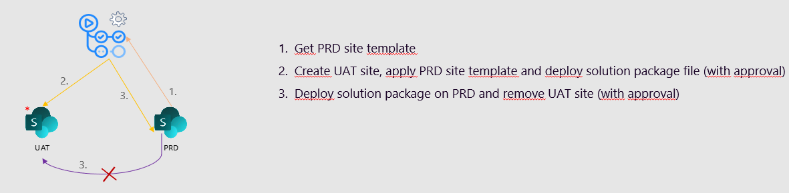

# react-webpart-ccs-22

## Summary

This solution sample was used for the Canadian Cloud Summit 2022, in the session *Apply a DevOps process to your SharePoint Online project!*.

It covers the scenario when creating an ephemeral site that will be removed once the PRD deployment job is achieved:

## Used SharePoint Framework Version

## Applies to

- [SharePoint Framework](https://aka.ms/spfx)
- [Microsoft 365 tenant](https://docs.microsoft.com/en-us/sharepoint/dev/spfx/set-up-your-developer-tenant)

> Get your own free development tenant by subscribing to [Microsoft 365 developer program](http://aka.ms/o365devprogram)

## Prerequisites

- A Microsoft 365 tenant with at least following permissions:
  - **Tenant Administration** permission
  - Azure **Application Administrator** permission
- A GitHub account

## Solution

Solution|Author(s)
--------|---------
CanCloudSummit22 | Michaël Maillot - onepoint (Twitter: [michael_maillot](https://twitter.com/michael_maillot))

## Version history

Version|Date|Comments
-------|----|--------
1.0|February 18, 2022|Initial release

## Disclaimer

**THIS CODE IS PROVIDED *AS IS* WITHOUT WARRANTY OF ANY KIND, EITHER EXPRESS OR IMPLIED, INCLUDING ANY IMPLIED WARRANTIES OF FITNESS FOR A PARTICULAR PURPOSE, MERCHANTABILITY, OR NON-INFRINGEMENT.**

---

## Minimal Path to Awesome

### Local project

- Clone this repository
- Ensure that you are at the solution folder
- In the command-line run:
  - **npm install**
  - **gulp bundle --ship**
  - **gulp package-solution --ship**

- go to the targeted app catalog (site collection or tenant depending on your scenario)
- deploy the .sppkg file (in the `sharepoint/solution` folder) on the app catalog
- add the solution to the site tagged as "Production" (PRD) (note the **URL of the PRD site** for later on)

### Azure AD

- Add a new AAD Application
- Add a new certificate for which you'll note locally (for the GitHub environment secrets later on):
  - the **password in clear**
  - the **thumbprint** (you can get it from the .cer file that you will upload to Azure)
  - the **base64 encoded certificate string** (you can get it from the pfx file by running this command: `[System.Convert]::ToBase64String([System.IO.File]::ReadAllBytes("C:\Temp\certificate.pfx"))`)
- Grant it Application permissions *Sites.FullControl.All* in SharePoint API (don't forget to grant admin consent)
- Note the **AAD Application ID** and the **Tenant ID** (Directory): they will be used later on

### GitHub Repo

#### Settings

- Add the following repository secret:
  - AAD_TENANT_ID: the **Tenant ID** (Directory)
- Add two environment
  - *UAT*
  - *PRD*
- For each environment, add the following secrets:
  - AAD_APP_ID: the **AAD Application ID**
  - AAD_APP_PASSWORD: **password in clear**
  - AAD_APP_THUMBPRINT: **thumbprint**
  - AAD_APP_ENCODED_CERTIFICATE: **base64 encoded certificate string**
- (optional) For each environment, add a reviewer that will approve the deployment
### GitHub Action

- Open the `main.yml` workflow file and update the following parameters:
  - **[repo_owner_username]** : your GitHub username
  - **[repo_name]**: the repo name
  - **site_url_prd**: the **URL of the PRD site**
  - **site_list_prd**: the relative URL of the list to export structure and data
  - **site_name_prd**: the name of the PRD site
  - **site_copy_owner**: the UAT copy site owner email
  - **webpart_name**: the name of the WebPart (as displayed in the WebPart list on SharePoint)
  - **app_catalog_scope**: the app catalog PRD scope (can be `tenant` or `site collection`)
- Commit and push the source code
- The `main` workflow should run in the *Actions* tab in the repo

(optional, if you want to use CLI for Microsoft 365):
- Open the `main.yml` workflow file and update the following lines:
  - comment the line 13 and comment out the line 14 (refering to the CLI for Microsoft 365 reusable workflow)
  - comment the line 22 and comment out the line 23 (passing the WebPart Id instead of the WebPart Name)
  - comment out thes line 28 & 45 (Adding the certificate thumbprint to the authentication parameters)
  - comment the line 32 and comment out the line 33 (refering to the CLI for Microsoft 365 reusable workflow)

## Features

Description of the extension that expands upon high-level summary above.

This sample illustrates the following concepts:

- Apply a CI / CD process for a SPFx project
- Setup multiple environments (with ephemeral UAT)
- Usage of PnP PowerShell and / or CLI for Microsoft 365

## References

### Default references

- [Getting started with SharePoint Framework](https://docs.microsoft.com/en-us/sharepoint/dev/spfx/set-up-your-developer-tenant)
- [Building for Microsoft teams](https://docs.microsoft.com/en-us/sharepoint/dev/spfx/build-for-teams-overview)
- [Use Microsoft Graph in your solution](https://docs.microsoft.com/en-us/sharepoint/dev/spfx/web-parts/get-started/using-microsoft-graph-apis)
- [Publish SharePoint Framework applications to the Marketplace](https://docs.microsoft.com/en-us/sharepoint/dev/spfx/publish-to-marketplace-overview)
- [Microsoft 365 Patterns and Practices](https://aka.ms/m365pnp) - Guidance, tooling, samples and open-source controls for your Microsoft 365 development

### GitHub Actions sample references

- [Encrypted secrets](https://docs.github.com/en/actions/security-guides/encrypted-secrets)
- [Using environments for deployment](https://docs.github.com/en/actions/deployment/targeting-different-environments/using-environments-for-deployment)
- [Reusable Workflows, Secrets and Environments](https://github.community/t/reusable-workflows-secrets-and-environments/203695)